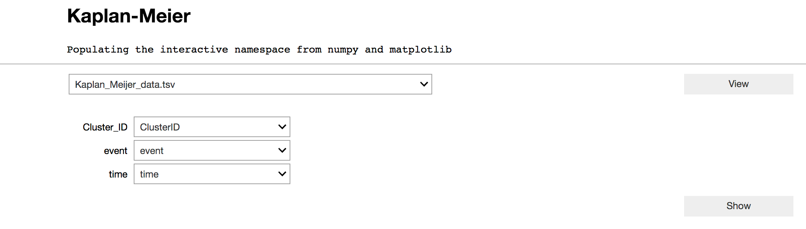
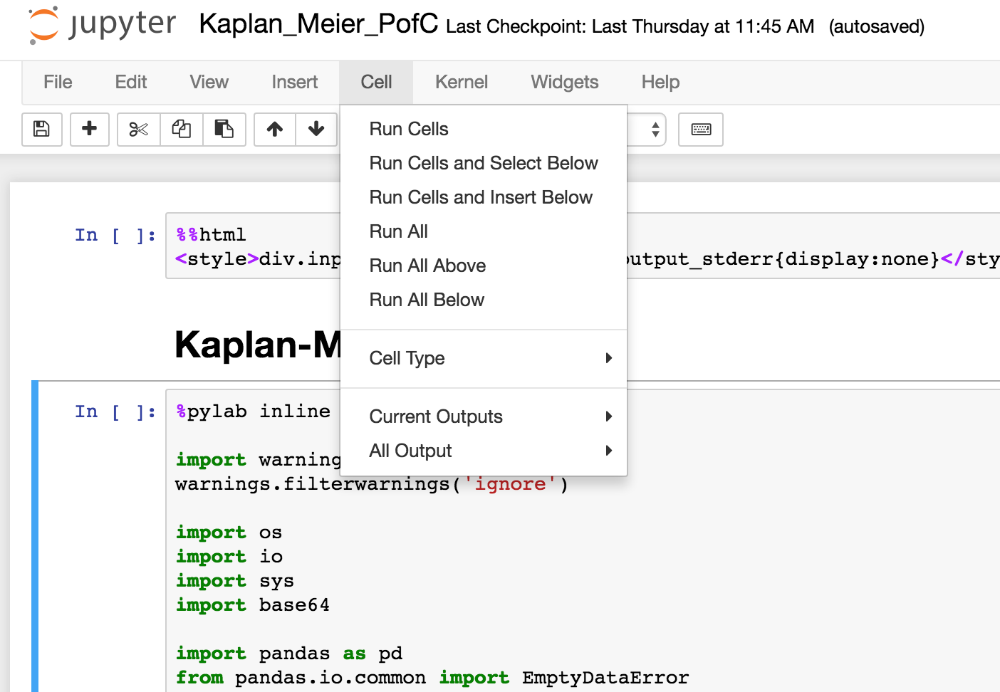
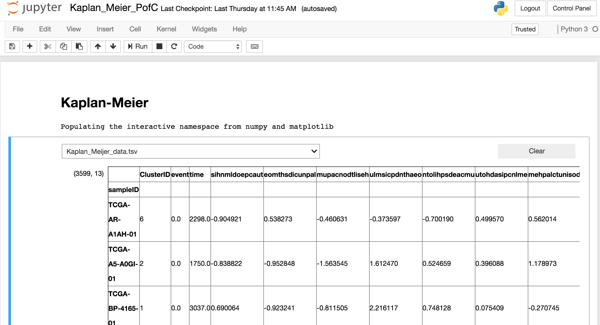
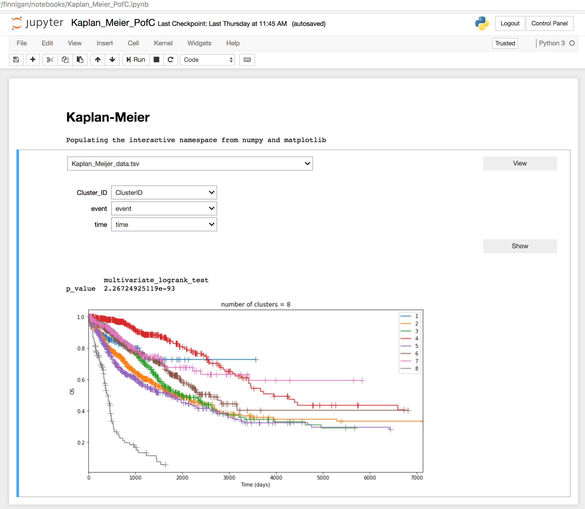
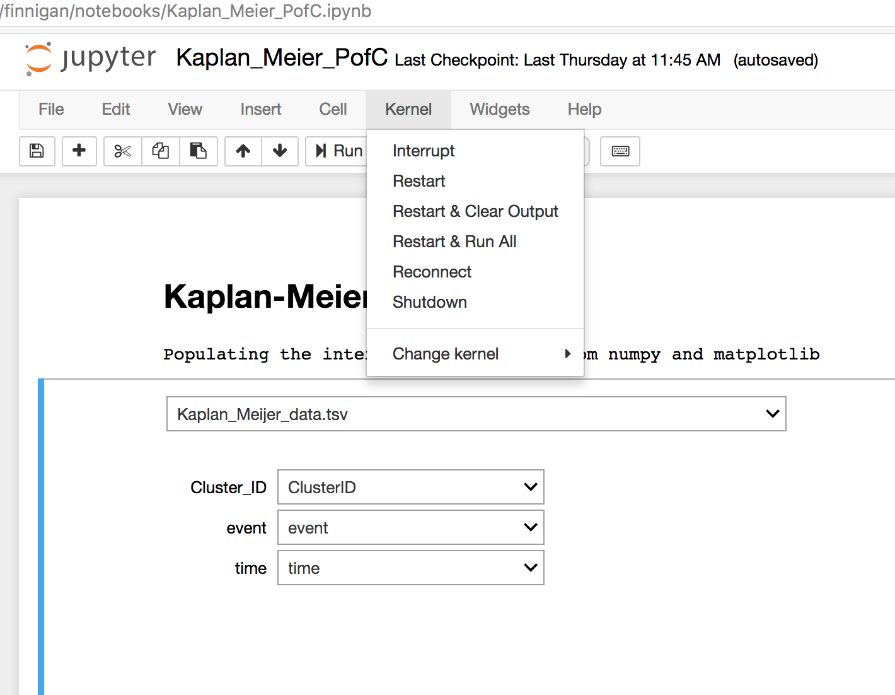

# KnowEnG's _Kaplan Meier Survival Analysis Jupyter Notebook_
 --- 

This is the Knowledge Engine for Genomics (KnowEnG), an NIH BD2K Center of Excellence, survival analysis notebook.

This notebook performs Kaplan - Meier survival analysis on selected phenotype data.

The input to the plot is:

| **ClusterID**                                      | **Event**                           | **Time**       |
|:------------------------------ |:------------------------------------- |:-------------------- |
| Phenotype category id         | indicator of survival                 | time of survival|

# Using the KnowEnG Kaplan_Meier.ipynb notebook.
 ---

### If your browser allows auto-initialization you will see this screen.

  

### If not, and the code is showing, use the _Cell_ menu to _Run All_

  

### Click on the **View** button to see the top of the phenotype file.

  

### Use listboxes to select columns for: ClusterID, Event and Time; click the **Show** button.

  

### Use the _Kernel_ menu _Restart and Clear Output_ to clear error messages (and all output).

  

