# KnowEnG's Signature Analysis Pipeline Notebook.
 --- 

This is the Knowledge Engine for Genomics (KnowEnG), an NIH BD2K Center of Excellence, Signature Analysis Pipeline.

This pipeline performs network-based **signature analysis** on the columns of a given spreadsheet, where spreadsheet's columns correspond to sample-labels and rows correspond to gene-labels.  The signature is based on correlating gene expression data (network enriched) against known gene signature data.

There are four similarity "signature"  methods that one can choose from:

- similarity        (traditional method) 
- net_similarity    (with network enrichment)
- cc_similarity     (with bootstraps)
- cc_net_similarity (with bootstraps and network enrichment)

and two correlation measures:
- spearman 
- cosine 

## _notebooks_KnowEnG_ Installation.
 ---

### First install the _Signature Analysis Pipeline_:
[Signature Analysis Pipeline Readme.md on github](https://github.com/KnowEnG-Research/Signature_Analysis_Pipeline/blob/master/README.md)

### Then install _notebooks_KnowEnG_:
[notebooks_KnowEnG Readme.md on github](https://github.com/dlanier/notebooks_KnowEnG/blob/master/README.md)

## Run  _Signature_Analysis_Pipeline_notebook.ipynb_

### If your browser allows auto-initialization you will see this screen.

  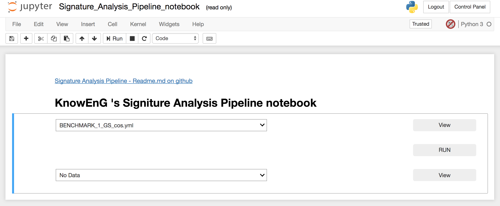

### If not, and the code is showing, use the _Cell_ menu to _Run All_

  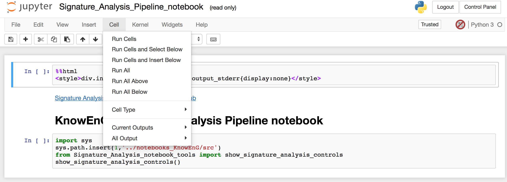

### Click on the **View** button to see the selected run_parameters file.

  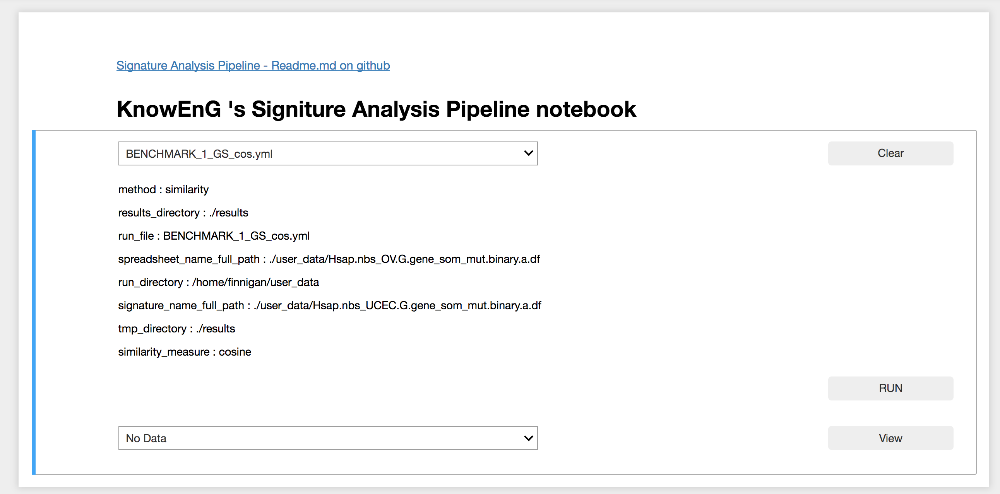

### Click the **Run** button and the pipeline runs with the selected yaml file run_parameters.

  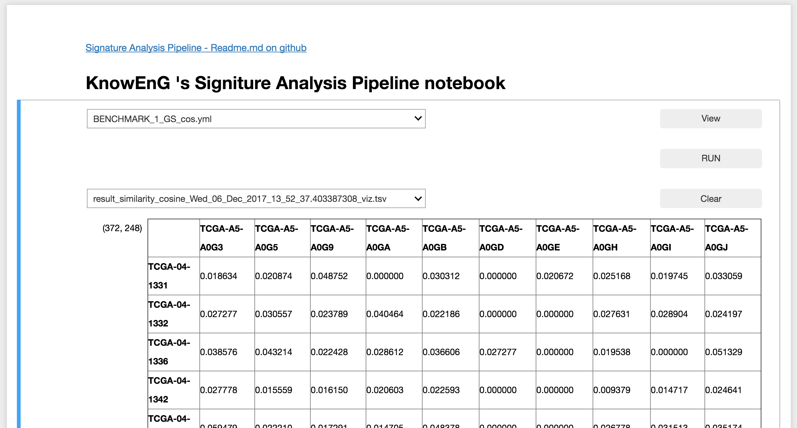

### Use _Kernel_ menu _Restart and Clear Output_ to clear error messages (and all dispalyed output).

  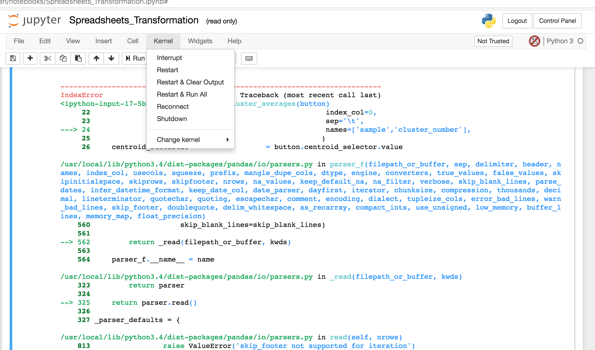

 

## Upload, view and transform your data:
 ---

### Use the _File_ menu _Open_ . 

  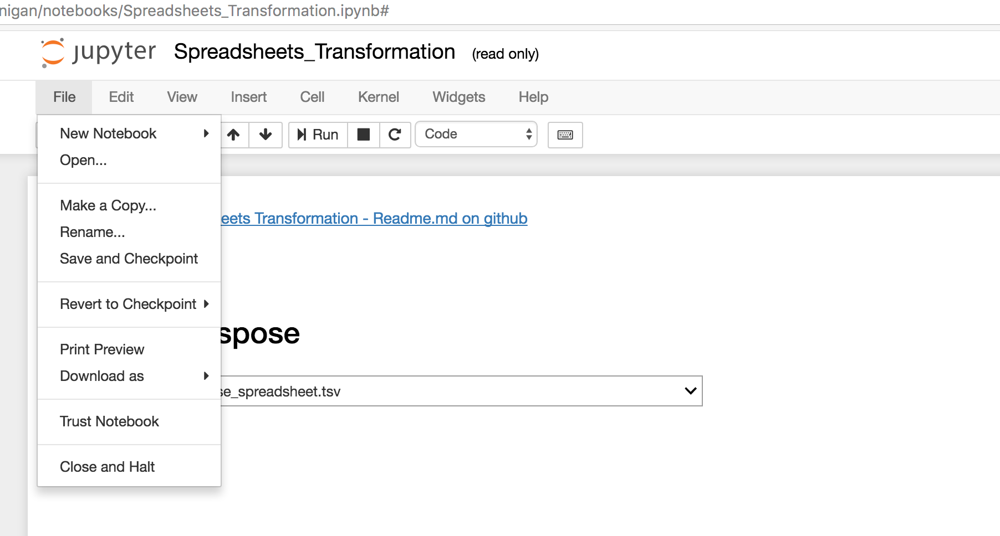

#### Select the _user_data_ directory.

  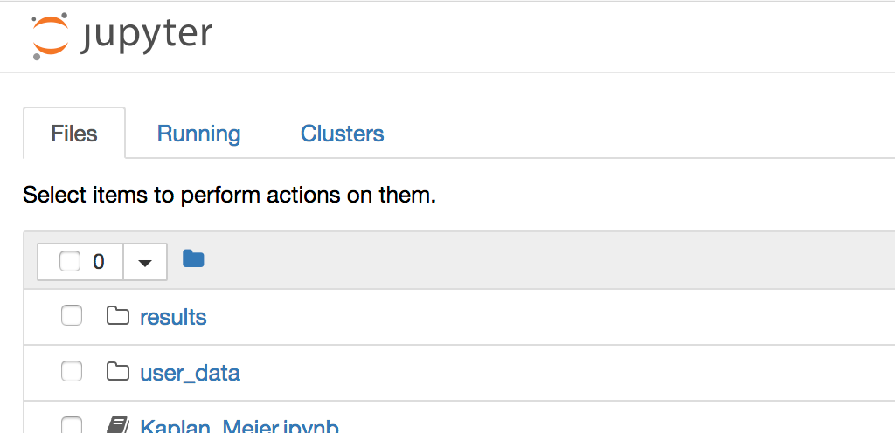

#### Click the _upload_ button to browse your computers files.

  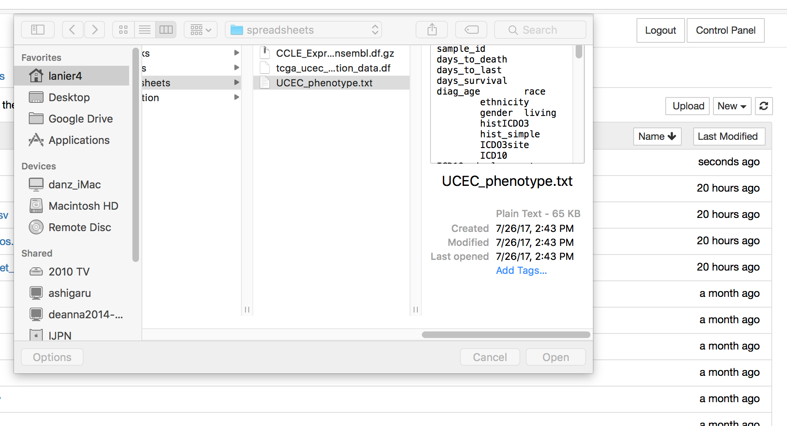

#### Click the highlighted _upload_ button begin the upload.

  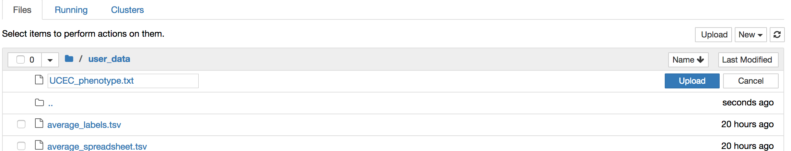

#### The file will appear in alphabetical order when the upload is complete.

  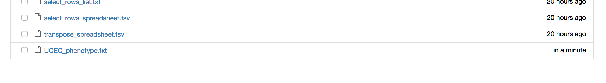

## 3) Rename, download or delete your result files in the _results_ directory.

  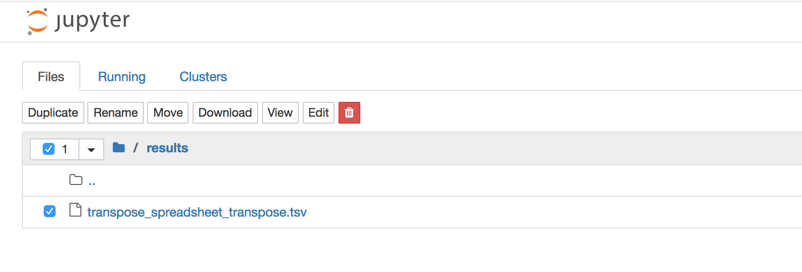

